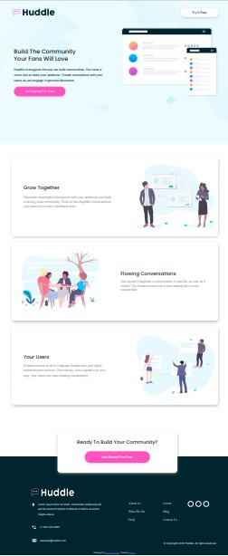

# Frontend Mentor - Huddle landing page with alternating feature blocks solution

This is a solution to the [Huddle landing page with alternating feature blocks challenge on Frontend Mentor](https://www.frontendmentor.io/challenges/huddle-landing-page-with-alternating-feature-blocks-5ca5f5981e82137ec91a5100). Frontend Mentor challenges help you improve your coding skills by building realistic projects. 

## Table of contents

- [Overview](#overview)
  - [The challenge](#the-challenge)
  - [Screenshot](#screenshot)
  - [Links](#links)
- [My process](#my-process)
  - [Built with](#built-with)
  - [What I learned](#what-i-learned)
  - [Continued development](#continued-development)
  - [Useful resources](#useful-resources)
- [Author](#author)
- [Acknowledgments](#acknowledgments)

**Note: Delete this note and update the table of contents based on what sections you keep.**

## Overview

### The challenge

Users should be able to:

- View the optimal layout for the site depending on their device's screen size
- See hover states for all interactive elements on the page

### Screenshot




### Links

- Solution URL: [Git hub](https://github.com/muakone/alternative-feature-block.git)
- Live Site URL: [live site](https://muakone.github.io/alternative-feature-block/)

## My process

### Built with

- Semantic HTML5 markup
- CSS custom properties
- Flexbox
- CSS Grid
- Mobile-first workflow


### What I learned
```css
.footer-logo {
    filter: invert(150%) sepia(120%) saturate(100%) hue-rotate(2000deg) brightness(190%) contrast(97%);
}
```


## Author

- Website - [Muak1](https://muakone.github.io/alternative-feature-block/)
- Frontend Mentor - [@muak](https://www.frontendmentor.io/profile/muak)
- Twitter - [Muhiz Akanni](https://www.twitter.com/@Muhiz_akanni)
